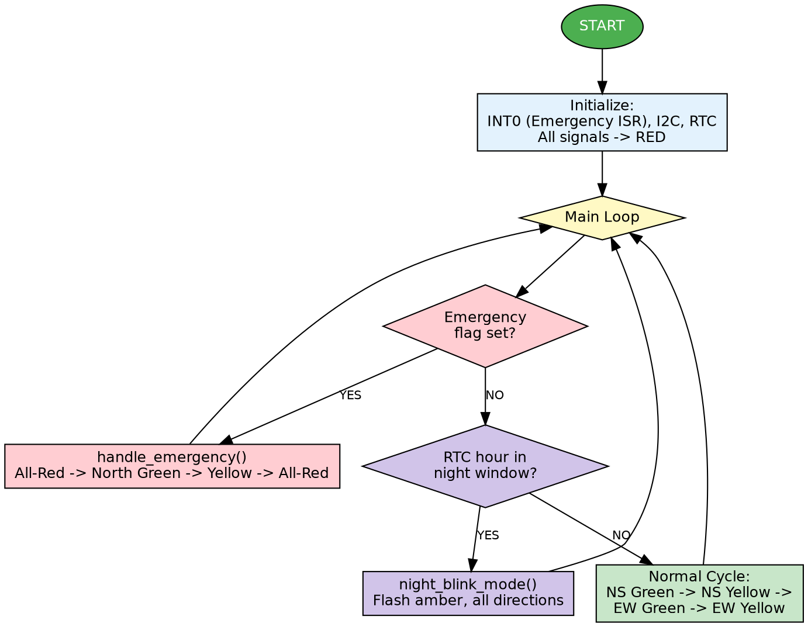
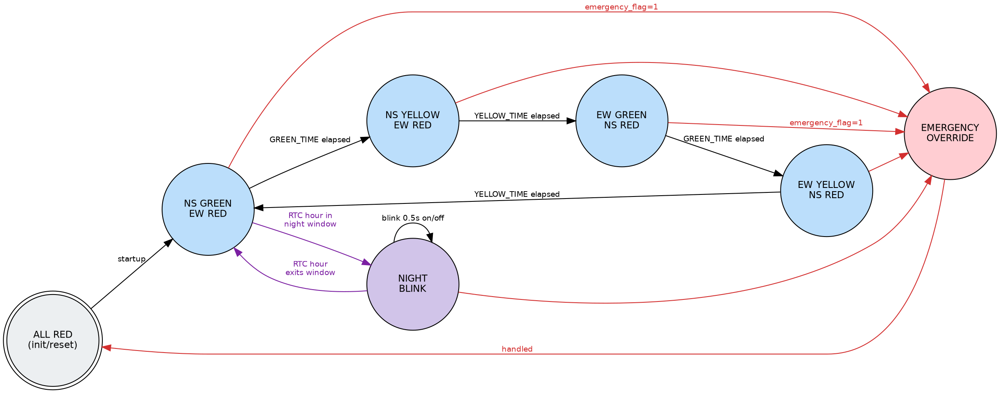

# Smart Traffic Light Controller (8051, Keil C)

   

An intermediate-level embedded systems project simulating a 4-way traffic
junction with two added "smart" features:

1. **Emergency vehicle override** — an ambulance/police sensor (or a push
   button standing in for one) triggers an external interrupt that clears
   the junction immediately.
2. **RTC-based night mode** — a DS1307 real-time clock is read each cycle;
   during late-night hours all signals switch to a flashing-amber "caution"
   mode instead of the normal red/green cycle, just like real intersections.

No physical hardware is required — build in Keil uVision and simulate the
whole circuit in Proteus.

## Repository structure

```
SmartTrafficLightController/
├── main.c              # State machine, interrupt handler, night-mode logic
├── traffic.h           # Pin mapping + timing constants
├── delay.c / delay.h   # Software delay routines
├── i2c.c / i2c.h       # Bit-banged software I2C master
├── ds1307.c / ds1307.h # DS1307 RTC driver (built on the I2C driver)
├── docs/
│   ├── Flowchart.png       # Main control-loop flowchart
│   ├── StateDiagram.png    # Finite state machine diagram
│   ├── CircuitDiagram.png  # Block / connection diagram
│   └── Project_Report.pdf  # Full written project report
├── .gitignore
├── LICENSE
└── README.md
```

## Diagrams

| | |
|---|---|
|  |  |

The `docs/CircuitDiagram.png` is a functional block/wiring diagram generated for this repo. For an exact component-level schematic, export a screenshot of your actual Proteus `.pdsprj` circuit and replace this file before your final submission.

## Pin connections (for your Proteus schematic)

| Signal                     | Pin        |
|----------------------------|------------|
| North Red / Yellow / Green | P1.0 / P1.1 / P1.2 |
| South Red / Yellow / Green | P1.3 / P1.4 / P1.5 |
| East  Red / Yellow / Green | P2.0 / P2.1 / P2.2 |
| West  Red / Yellow / Green | P2.3 / P2.4 / P2.5 |
| Emergency sensor / button  | P3.2 (INT0), active-low, pull-up to VCC |
| DS1307 SDA                 | P0.0 (add ~4.7k pull-up) |
| DS1307 SCL                 | P0.1 (add ~4.7k pull-up) |

Use 12 LEDs (3 per direction) for the signals, a push-button (or logic
state generator) tied to P3.2 for the "emergency vehicle," and a DS1307 RTC
module with its coin-cell battery for the clock.

## Building & simulating

1. Open Keil uVision → create a new project → select **AT89C51** (or
   AT89S52).
2. Add all six `.c` files to the project (headers are picked up
   automatically via `#include`).
3. Build → generate the `.hex` file.
4. In Proteus: drop the 8051, LEDs, DS1307, push button, and pull-up
   resistors as per the pin table above, load the `.hex` file onto the MCU,
   and run the simulation.
5. **First run only:** open `ds1307.c`, uncomment the "set time" block
   inside `ds1307_init()`, set the hour/minute you want, run once so the
   RTC is programmed, then comment that block back out (otherwise the
   clock resets to that time on every power-up).

## How it behaves

- **Normal cycle:** North+South green while East+West red, then a yellow
  transition, then East+West green while North+South red, repeating.
- **Emergency:** pulling P3.2 low mid-cycle immediately forces all-red,
  then gives North a green window, then returns to the normal cycle.
- **Night mode:** once the RTC hour is ≥ `NIGHT_START_HOUR` (22) or
  < `NIGHT_END_HOUR` (6), every direction flashes amber instead of cycling.
  Adjust these in `traffic.h`.

## Possible extensions (for a viva / report "future scope" section)

- Add IR/ultrasonic sensors per lane for traffic-density-based green time.
- Add a 7-segment or LCD countdown timer per direction.
- Support 4 independent emergency sensors instead of one shared line.
- Log every cycle's timestamp to external EEPROM for a "traffic report."
